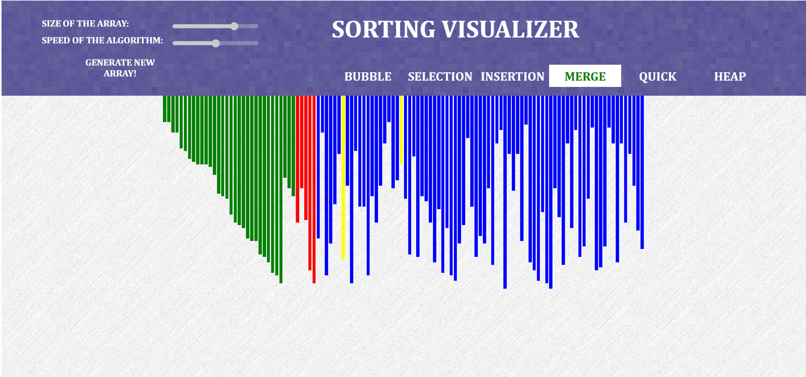

# Sorting_Visualizer

This project is a Web Visualization tool for sorting algorithms.

*Red color -> denotes the pointer which is finding the desired element.
*Green color-> denotes the sorted element.
*Yellow color-> denotes current position of the traversal.
*Blue color-> denotes the elements yet to be sorted.

